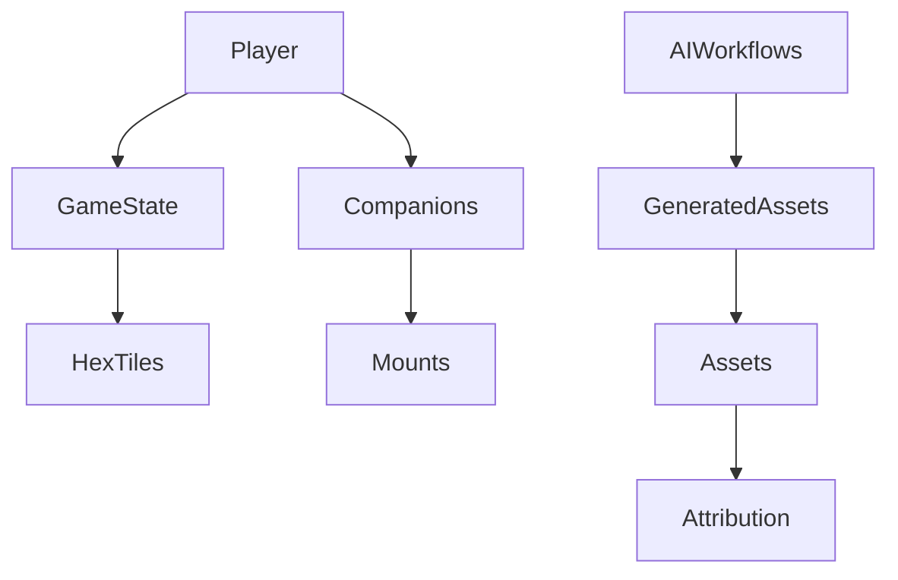

# Database Schema

Dragon's Labyrinth uses SeaORM with SQLite for game state persistence and asset tracking.

## Core Tables

### Players
- Save slots and progression tracking
- Dread level management
- Position and inventory

### Companions
- Full psychological models
- Trauma responses
- Relationship dynamics
- Mount bonding mechanics

### Game State
- World persistence
- Hex board state
- Environmental decay tracking
- Forge trial progress

### Assets & Attribution
- CC0 asset tracking
- Attribution management
- Asset dependencies
- Performance metrics

### AI Workflows
- Generation tracking
- Build-time asset creation
- Quality scores
- Review status

### Generated Assets
- AI-created content tracking
- Prompt history
- Generation parameters
- Integration status

## Key Relationships

## Database Operations

The `GameDatabaseOperations` trait provides 44+ async methods for:
- Player progression
- Companion state management  
- Asset querying
- Horror event tracking
- Forge trial management
- Save/load operations

## Build-Time vs Runtime

- **Build-time**: Asset indexing, AI generation tracking
- **Runtime**: Game state, player progress, companion states

All models are defined in the `database-orm` crate for single source of truth.
